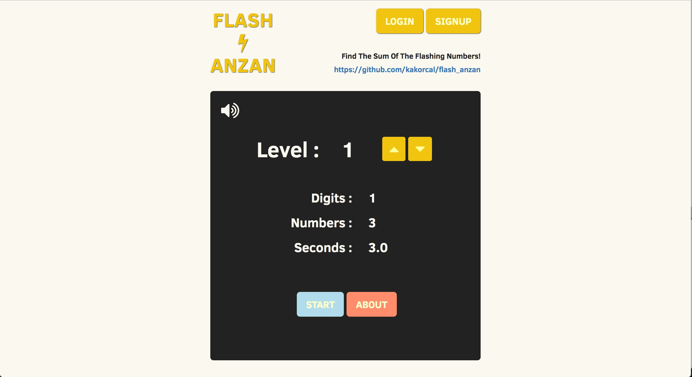
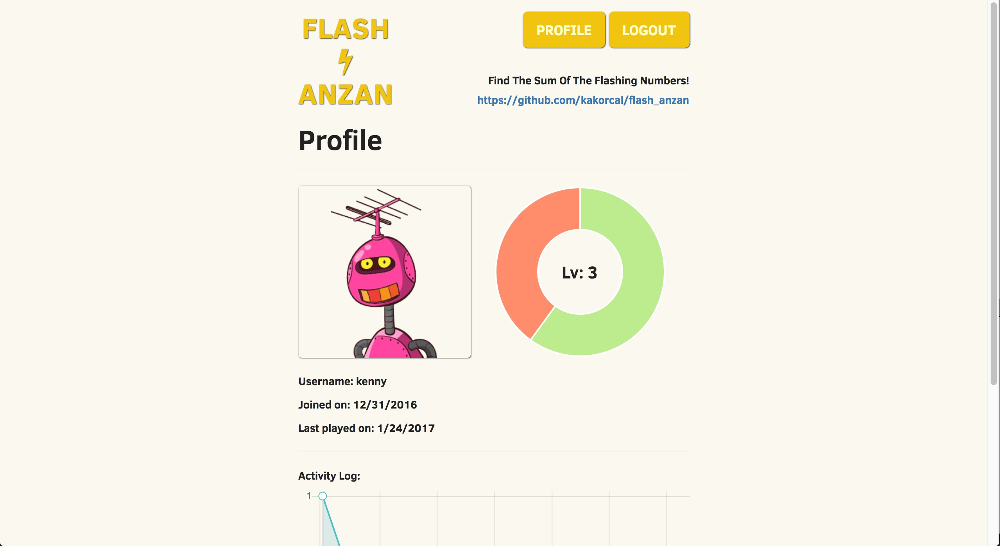

#Flash Anzan
VIEW LIVE - https://flashanzan.herokuapp.com/
> Flash Anzan is a mental arithmetic application where players can train their memory by calculating the sum of numbers that flash on the screen. This game was originally created by a Japanese teacher as an alternative for using the [soroban](https://en.wikipedia.org/wiki/Soroban).
Here are several sources for more information:
* [Wikipedia article](https://en.wikipedia.org/wiki/Mental_abacus)
* [Article about flash anzan and soroban](https://www.theguardian.com/science/alexs-adventures-in-numberland/2012/oct/29/mathematics)
* [More in depth about flash anzan and Japanese education](https://www.tofugu.com/japan/japanese-math/)

***

## TODOS
* Edit photo feature
* Add RC2 view past month, year... next week, prev week buttons
* Add loading state
* Enhance game feature: subtraction, multiplication...
* Refactor app.js error / exception handling
